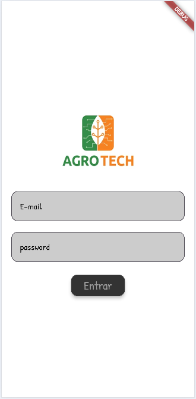
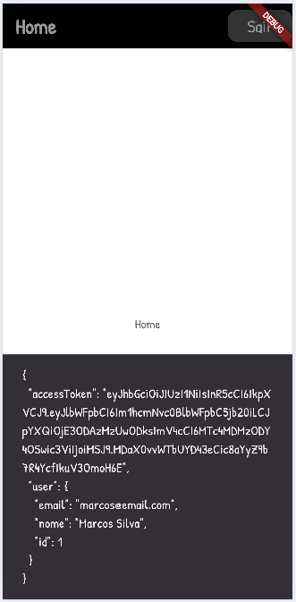

# App AgroTech

Projeto educacionail para aulas de *programação para dispositivos moveis* com o framework **flutter**
- Tela de Login
- Tela Home
- API com autenticação JWT

## Tema Agronegócio
Duas coleções de dados, *um para muitos*, um **usuário**/funcionário muitos **animais**

## Tecnologias
- Flutter
- Android Studio
- VsCode

## Para testar
- 1 Clone o repositório da [API](https://github.com/wellifabio/agro-api-jserver-swagger.git), necessário Node.js instalado no computador
    - Abra com VsCode, e em um terminal execute os comando a seguir para instalar as dependências e executar
    ```bash
    npm install
    npm run dev
    ```
- 2 Clone este repositório
    - Abra com VsCode e em um terminal execute os comando a seguir para instalar as dependências e executar
    ```bash
    flutter pub get
    flutter run
    ```
    - Escolha executar em um navegador *Chrome* por exemplo:
## Print das telas
|||
|:-:|:-:|
|Tela de login|Home|

## Atividade01
- Conclua o processo de login
    -  Armazene os dados do usuário e o **token** localmente via *SharedPreferences* para transmití-los para a tela de login.
    - Mostre o nome do usuário logado no título da appBar ex: "Home: Marcos Silva"
    - Liste os animais na rota /animais enviando o *Bearer* **token** no header da requisição para garantir que está autenticado.
    - Ao clicar em um ítem da lista mostre os detalhes em um modal.
### Wireframes

## Atividade02
- Acrescente um botão flutuante no final da página (+) para abrir um modal com um formulário para adicionar animais.
- No modal de detalhes acrescente funcionalidades para alterar os dados do animal e um botão para salvar
- Ao clicar na foto do animal no modal de detalhes, abra a câmera para tirar uma foto e envie para a API alterando o campo imagem